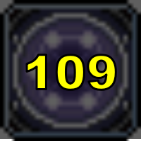

# MapleStory Janus Timer

메이플스토리 사냥 중 스킬 쿨다운을 눈으로 확인하기가 불편해서 직접 만든 오버레이 타이머입니다.

`pynput`으로 키 입력을 전역에서 감지하기 때문에, 게임에 포커스가 있는 상태에서 지정한 스킬 키를 누르는 순간 타이머가 돌기 시작합니다. 쿨다운이 도는 동안 화면 위에는 남은 시간이 큼직하게 표시되고, 끝나면 알림음으로 알려줍니다. 게임 위에 투명하게 띄워둘 수 있어, 알트탭 없이 사냥에 집중한 채로 쿨타임을 관리할 수 있습니다.

| 대기 | 쿨다운 |
| :---: | :---: |
|  |  |

## 기능

- **전역 키 감지** — 게임이 포커스를 잡고 있어도 지정한 스킬 키를 감지해 타이머를 시작합니다.
- **쿨다운 중 재입력 무시** — 쿨이 도는 도중에 키를 또 눌러도 타이머가 리셋되지 않습니다.
- **카운트다운 표시** — 남은 시간을 큰 숫자로 보여주고, 배경이 아래에서 위로 차오르며 진행도를 나타냅니다.
- **완료 알림음** — 쿨다운이 끝나면 소리로 알려줍니다. (wav / mp3 지원, 볼륨 조절 가능)
- **오버레이 모드** — 테두리 없이 투명하게, 항상 위에, 클릭이 통과하도록 게임 위에 띄웁니다. 조준이나 클릭을 방해하지 않습니다.
- **설정창** — 트리거 키, 쿨다운 시간, 창 크기, 배경 이미지, 알림음, 투명도를 자유롭게 바꾸고 즉시 반영됩니다.
- **설정 자동 저장** — 모든 설정과 창 위치가 저장되어 다음 실행 때 그대로 복원됩니다.

## 다운로드 & 실행

[Releases](../../releases)에서 최신 `JanusTimer.zip`을 받아 압축을 풀고 **`JanusTimer.exe`** 를 실행하세요. 파이썬 설치는 필요 없습니다.

```
JanusTimer.zip
├─ JanusTimer.exe
├─ background.png   (기본 배경 이미지)
└─ alarm.wav        (기본 알림음)
```

세 파일은 같은 폴더에 두면 됩니다. 배경 이미지와 알림음은 원하는 파일로 교체하거나, 설정창에서 다른 파일을 직접 지정할 수 있습니다.

## 조작

| 동작 | 방법 |
| --- | --- |
| 쿨다운 시작 | 트리거 키 (기본 `3`) |
| 오버레이 모드 토글 | `Ctrl+Alt+O` (설정에서 변경 가능) |
| 위치 이동 | 본문 드래그 (일반 모드) |
| 설정 / 종료 | 우클릭 (일반 모드) |

> 오버레이 모드는 클릭이 통과하므로 마우스로 잡을 수 없습니다. 위치를 옮기거나 설정을 열려면 먼저 `Ctrl+Alt+O`로 일반 모드로 돌아오세요.

처음 실행했다면 **우클릭 → 설정**에서 트리거 키부터 바꿔주세요. 기본값이 숫자 `3`이라, 그대로 두면 평소 입력과 충돌합니다.



## 관리자 권한

많은 게임이 관리자 권한으로 실행됩니다. 이 경우 타이머도 같은 권한으로 실행되어야 게임이 포커스를 잡고 있을 때 키 입력을 감지할 수 있습니다. 권한이 낮은 프로그램의 입력 후킹을 차단하는 Windows 정책 때문이며, 코드로 우회할 수 없습니다.

Releases에 배포되는 실행 파일은 관리자 권한을 자동으로 요청하도록 빌드되어 있어, 실행 시 뜨는 권한 요청을 **허용**하면 됩니다. 거부하면 게임 중에 키 입력을 받아오지 못합니다.

## 동작 환경

Windows 환경을 기준으로 개발하고 테스트했습니다. 다른 OS에 대한 호환성은 별도로 확인하지 않았습니다.

## 라이선스

[MIT](LICENSE)

기본 첨부 효과음: [freesound.org/s/318687](https://freesound.org/s/318687/) (라이선스: Creative Commons 0)
